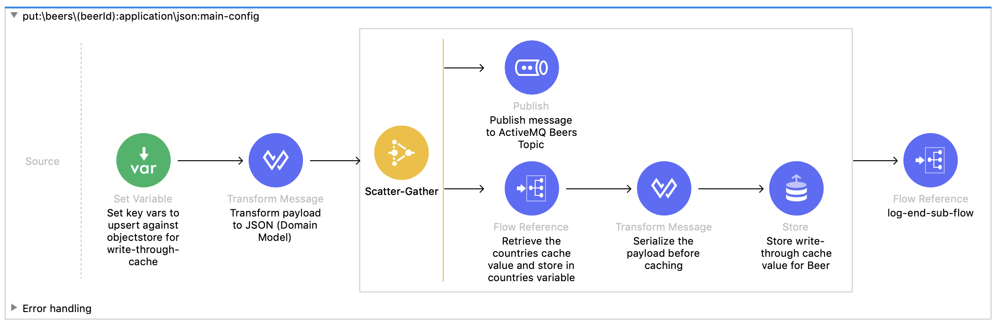

# Introduction

This application acts as a process API for a start up that provides monthly subscriptions to crates of beers from all over the world.

There are mobile applications for both Breweries and Customers.

This application offers the Customers Experience API access to metadata about beers available for monthly packages.

For Breweries they have the ability to create new Beers that they would like to make available to Customers in near-real time.


# Getting Started

## Import into Anypoint Studio from binary

Import the binary into Anypoint Studio

Right click in the Package Explorer and click Import

Find the location of the .jar application and import into Studio

## Import into Anypoint Studio from GIT

This is not currently possible as the applications parent pom is not in a public source control so you cannot build it locally.

For now this is just used as documentation: https://github.com/michael-jakeman/beers-process-api

## Running the applications locally

The easiest way to run your application locally is to create a local-properties.yaml file in src/main/resources. The .gitignore file contains a rule to omit any local properties so these will never accidently be committed to the source code repo.

All you'll need to do is add the local-properties.yaml file to src/main/resources and in the Run Configurations for you application add -Denv=local to your VM arguements.

Finally, ensure you read the section on Gateway Offloading to ensure your Postman is configured correctly

## Running Unit Tests

To run MUnit tests they can either be run from Anypoint Studio or from the terminal.

Simply right click and run from studio or run 'mvn test' in terminal.

Running mvn test will run all JUnit and MUnit test cases.

## Shared RAML Components

The API includes both a common library and common data types.

The common library helps users implement standard functionality such as ordering, pagination and filtering

Common data types ensure that data within the domain is standardised.

# Design Patterns

## Read Through Cache

A basic read-through cache is implemented on the GET:/beers endpoint caching against the URI of the request.

The cache is configured to last 15 minutes.


	
## Write Through Cache

The PUT:/beers/{beerId} endpoint implements a write-through cache. The message is transformed into the domain model and parallelly published to JMS Topic and updated in the cache.



The Beer resource is cached in the GET:/beers/{beerId} endpoint


## Cache Aside
Country metadata rarely changes, the application is configured to refresh the country cache once per day.

The countries API returns a list of countries, which are converted into as hashmap and serialized to enable developers to easily access country metadata.


## Bounded Context/Service Layer

The API uses standard Exchange assets for requests/responses ensuring that data matches the domain model. 

## Content Enricher

Using the Cache Aside design pattern the API utilises Content Enricher to enrich the payload with Country metadata 

## CQRS

The PUT:/beers/{beerId} endpoint executes the Command to ActiveMQ Topic to create a 'Beer'.


Usually other APIs would be listening to this topic to either:

- Create or Update the Beer in the source system
- Be notified that a new Beer has been created

However, as I've only got the one API to build then I've also implemented the subscriber to this topic which consumes and ack's the message. Further processing of the message is out of scope for this API.

## Gateway Offloading

The application is configured to offload to the MuleSoft dedicated load balancer, but the application still exposes endpoints on HTTPS.

The MuleSoft dedicated load balancer doesnt perform host validation on the certificates, so when running locally ensure that your postman settings has got *SSL client verficiation OFF* otherwise you'll be unable to hit to service.


# Design Principles

## REST

The application implements RESTful API best practices

## API Manager Plugin

The application makes use of a custom Maven plugin that integrates with the API Manager Platform APIs to allow API configuration as code.

This project is still a WIP and currently only available as a SNAPSHOT.

The source code for the Maven plugin can be found here: https://github.com/michael-jakeman/maven-api-manager-plugin please view this to see how to configure your plugin.

## Running the plugin

The dependency for the plugin is in the parent pom and the plugin configuration is in the project pom.xml.

Ensure that you have correctly configured your plugin config including:

```
<configuration>
    <credentials>
        <username></username>
        <password></password>
    </credentials>
    <exchangeAsset>
        <groupId></groupId>
        <assetId></assetId>
        <version></version>
        <productVersion></productVersion>
    </exchangeAsset>
    <environment></environment>
...
</configuration>
```

You will need to have the Exchange Asset published to your Organisations Exchange for the plugin to work as it creates an API based on the Exchange Asset and applies policies.

To run the plugin simply run (ensure that you have filled out the required xml elements in the plugin)

```
mvn com.mike.codes:api-manager-plugin:1.0.0-SNAPSHOT:apply-policies
```

## Cloudhub notifications

If parts of the API fail then alerts are triggered informing DevOps teams that there's been an error in the API.

For this to work correctly you'll need to configure alerts in Runtime Manager and ensure that you've set cloudhub.username, cloudhub.password and cloudhub.environment correctly. Usually this would be set by Jenkins.


# Future Improvements

The following endpoints have not been implemented but are on the roadmap. It would be useful for breweries not to need to know what ID they want their beer to be created with, but as it's an asynchronous process they'll need to know how to access the beer for now.

## POST:/beers

In future we'll generate an ID in the POST section so we can return this to the client with 202 Accepted status code, then create use the same logic as the PUT flow

## GET:/beers/{beerId}/reviews

In future we'll integrate with social media and maintain a cache of reviews for each product.